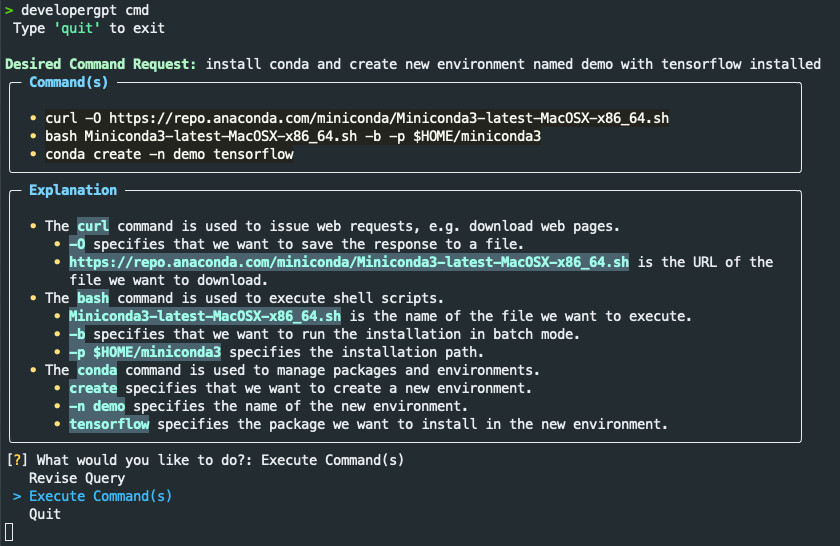
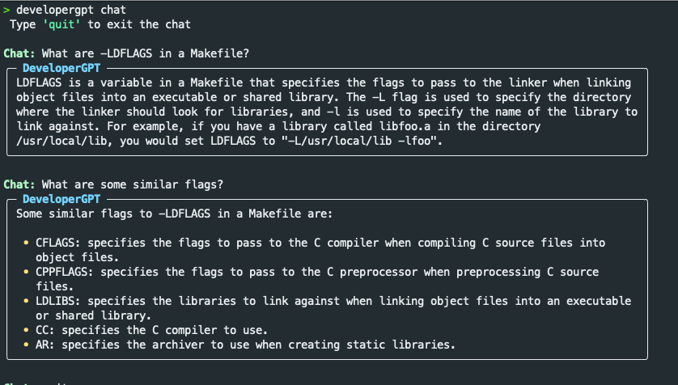

# DeveloperGPT
[](./LICENSE)
<!-- [](https://codecov.io/gh/luo-anthony/DeveloperGPT) -->
[](https://github.com/luo-anthony/DeveloperGPT/actions/workflows/main.yml)
[](https://pypi.org/project/developergpt/)

DeveloperGPT is a terminal application that uses the OpenAI API + gpt-3.5-turbo model to help developers be more productive. Currently DeveloperGPT provides two main functionalities
### 1. Natural Language to Terminal Commands


### 2. Chat with OpenAI GPT-3.5 Inside the Terminal


NOTE: Chat moderation is **NOT** implemented - all your chat messages should follow the OpenAI terms of use. 


## Install it from PyPI
```bash
pip install developergpt
```

### Setup
Get your own OpenAI API Key: https://platform.openai.com/account/api-keys

```bash
# Do this once 
# set OpenAI API Key (using zsh for example)
$ echo 'export OPENAI_API_KEY=[your_key_here]' >> ~/.zshenv
```

## Usage
```bash
# see available commands
$ developergpt 

# chat with GPT-3.5 inside the terminal 
$ developergpt chat

# natural language to termianl commands
$ developergpt cmd
```

## Development

Read the [CONTRIBUTING.md](CONTRIBUTING.md) file.

### Future Work
- Add tests + update CI pipeline
- Switch to poetry package manager 
- Prettify model output 
- Support other models (hugging-face)
- Add docs 

## Credit
This repository uses the Python project template from https://github.com/rochacbruno/python-project-template
This project was written with assistance from ChatGPT and Github CoPilot. 
